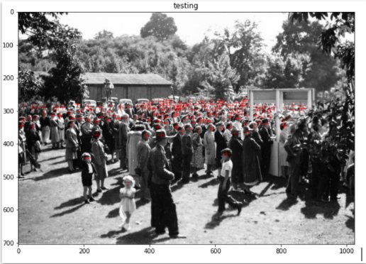
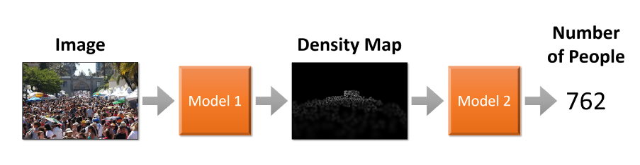

# Crowd_Analysis-with-CNN

## Detect and count the number of people in a densly crowded place

The dataset we ended up being used was the “Shanghai Tech” dataset (https://paperswithcode.com/dataset/shanghaitech), a dataset specifically created for crowd counting and density estimation. It contains 1198 annotated images of crowds of all different types. The annotations give us the coordinates of every person for each image.

  

The Project consists of two models :
  .* Model 1: Generate the density map for a given image to the model
  .* Model 2: Predict the number of people in the density map
  

    
  
  The purpose of the model was to take in an image and to automatically produce a density map for it. For this we use a type of Convolutional Neural Network called CSRnet. Typical ConvNets work by applying different convolution operations on the image. Similarly CSRnets also work on that principle, the difference being that the kernel gets dilated before being applied.

